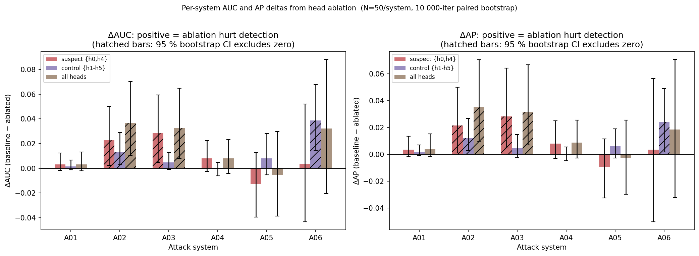

# AUC / AP Re-analysis of Head Ablation Predictions

Re-analyzes `per_sample_preds.pt` (N=50 per system, 350 total) using AUC and Average Precision instead of EER. The EER table had 2pp resolution, leaving 3 of 6 systems inside the noise floor. All CIs from 10 000-iteration paired bootstrap (95 %).

Positive Δ = ablating those heads reduced the metric = those heads were helping detection for that system.

## Sanity checks

| system | baseline AUC | baseline AP | baseline EER | EER from preds | match? |
|--------|-------------|------------|--------------|----------------|--------|
| A01 | 0.9972 ± 0.0048 | 0.9973 | 0.0400 | 0.0400 | ✓ |
| A02 | 0.9764 ± 0.0238 | 0.9749 | 0.1000 | 0.1000 | ✓ |
| A03 | 0.9784 ± 0.0234 | 0.9764 | 0.0600 | 0.0600 | ✓ |
| A04 | 0.9812 ± 0.0198 | 0.9825 | 0.0600 | 0.0600 | ✓ |
| A05 | 0.9548 ± 0.0375 | 0.9595 | 0.1000 | 0.1000 | ✓ |
| A06 | 0.8264 ± 0.0807 | 0.8156 | 0.2600 | 0.2600 | ✓ |

_AUC < 0.5 at baseline would indicate a label-convention error. None found._

## Main table: AUC ± 95 % CI and Δ from baseline

Δ = baseline AUC − ablated AUC. \* = bootstrap 95 % CI of Δ excludes zero.

| system | baseline | Δ suspect {h0,h4} | Δ control {h1–5} | Δ all-heads |
|--------|----------|-------------------|------------------|-------------|
| A01 | 0.9972 ± 0.0048 | +0.0032 [-0.0017,+0.0124] | +0.0016 [-0.0012,+0.0068] | +0.0032 [-0.0020,+0.0132] |
| A02 | 0.9764 ± 0.0238 | +0.0230 [+0.0024,+0.0503]\* | +0.0133 [+0.0028,+0.0289]\* | +0.0368 [+0.0106,+0.0703]\* |
| A03 | 0.9784 ± 0.0234 | +0.0283 [+0.0048,+0.0595]\* | +0.0047 [-0.0008,+0.0128] | +0.0327 [+0.0082,+0.0649]\* |
| A04 | 0.9812 ± 0.0198 | +0.0080 [-0.0025,+0.0224] | -0.0004 [-0.0060,+0.0048] | +0.0079 [-0.0042,+0.0232] |
| A05 | 0.9548 ± 0.0375 | -0.0127 [-0.0397,+0.0128] | +0.0079 [-0.0052,+0.0281] | -0.0056 [-0.0388,+0.0298] |
| A06 | 0.8264 ± 0.0807 | +0.0034 [-0.0434,+0.0521] | +0.0387 [+0.0145,+0.0677]\* | +0.0321 [-0.0205,+0.0882] |

## Main table: AP ± 95 % CI and Δ from baseline

Δ = baseline AP − ablated AP. \* = bootstrap 95 % CI of Δ excludes zero.

| system | baseline | Δ suspect {h0,h4} | Δ control {h1–5} | Δ all-heads |
|--------|----------|-------------------|------------------|-------------|
| A01 | 0.9973 ± 0.0047 | +0.0035 [-0.0017,+0.0135] | +0.0016 [-0.0012,+0.0069] | +0.0037 [-0.0019,+0.0153] |
| A02 | 0.9749 ± 0.0273 | +0.0215 [+0.0010,+0.0499]\* | +0.0121 [+0.0028,+0.0267]\* | +0.0353 [+0.0096,+0.0705]\* |
| A03 | 0.9764 ± 0.0276 | +0.0283 [+0.0046,+0.0643]\* | +0.0047 [-0.0025,+0.0147] | +0.0314 [+0.0069,+0.0668]\* |
| A04 | 0.9825 ± 0.0192 | +0.0080 [-0.0030,+0.0249] | +0.0001 [-0.0047,+0.0054] | +0.0086 [-0.0028,+0.0253] |
| A05 | 0.9595 ± 0.0356 | -0.0093 [-0.0327,+0.0114] | +0.0060 [-0.0027,+0.0191] | -0.0027 [-0.0297,+0.0255] |
| A06 | 0.8156 ± 0.1061 | +0.0033 [-0.0503,+0.0565] | +0.0241 [+0.0017,+0.0489]\* | +0.0184 [-0.0323,+0.0707] |

## Direction comparison: EER vs AUC vs AP

EER Δ sign: + = ablation raised EER = heads were helpful. AUC/AP Δ sign: + = ablation lowered AUC/AP = heads were helpful. Directions should agree (both + or both −).

| system | config | EER Δ (pp) | AUC Δ | AUC CI excl 0? | AP Δ | AP CI excl 0? | agree? |
|--------|--------|-----------|-------|----------------|------|---------------|--------|
| A01 | suspect | +0 | +0.0032 | no | +0.0035 | no | — |
| A01 | control | +2 | +0.0016 | no | +0.0016 | no | ✓ |
| A01 | all-heads | +0 | +0.0032 | no | +0.0037 | no | — |
| A02 | suspect | +2 | +0.0230 | \* | +0.0215 | \* | ✓ |
| A02 | control | +0 | +0.0133 | \* | +0.0121 | \* | — |
| A02 | all-heads | +4 | +0.0368 | \* | +0.0353 | \* | ✓ |
| A03 | suspect | +4 | +0.0283 | \* | +0.0283 | \* | ✓ |
| A03 | control | +0 | +0.0047 | no | +0.0047 | no | — |
| A03 | all-heads | +4 | +0.0327 | \* | +0.0314 | \* | ✓ |
| A04 | suspect | +2 | +0.0080 | no | +0.0080 | no | ✓ |
| A04 | control | +2 | -0.0004 | no | +0.0001 | no | — |
| A04 | all-heads | +2 | +0.0079 | no | +0.0086 | no | ✓ |
| A05 | suspect | -4 | -0.0127 | no | -0.0093 | no | ✓ |
| A05 | control | +0 | +0.0079 | no | +0.0060 | no | — |
| A05 | all-heads | -4 | -0.0056 | no | -0.0027 | no | ✓ |
| A06 | suspect | +0 | +0.0034 | no | +0.0033 | no | — |
| A06 | control | +4 | +0.0387 | \* | +0.0241 | \* | ✓ |
| A06 | all-heads | +6 | +0.0321 | no | +0.0184 | no | ✓ |

## Within-noise EER systems: do AUC/AP resolve them?

### A01

EER note: EER Δ = 0 for suspect, +2pp for control — both ≤ 1 EER step from baseline

- **suspect {h0,h4}**: AUC Δ = +0.0032 [-0.0017, +0.0124]  AP Δ = +0.0035 [-0.0017, +0.0135]  → unresolved (CI spans zero)
- **control {h1–h5}**: AUC Δ = +0.0016 [-0.0012, +0.0068]  AP Δ = +0.0016 [-0.0012, +0.0069]  → unresolved (CI spans zero)

### A02

EER note: EER Δ = +2pp for suspect (1 EER step; ablation hurt = suspects helpful)

- **suspect {h0,h4}**: AUC Δ = +0.0230 [+0.0024, +0.0503]  AP Δ = +0.0215 [+0.0010, +0.0499]  → **resolved** (positive (heads helpful))
- **control {h1–h5}**: AUC Δ = +0.0133 [+0.0028, +0.0289]  AP Δ = +0.0121 [+0.0028, +0.0267]  → **resolved** (positive (heads helpful))

### A04

EER note: EER Δ = +2pp for both suspect and control (1 EER step each)

- **suspect {h0,h4}**: AUC Δ = +0.0080 [-0.0025, +0.0224]  AP Δ = +0.0080 [-0.0030, +0.0249]  → unresolved (CI spans zero)
- **control {h1–h5}**: AUC Δ = -0.0004 [-0.0060, +0.0048]  AP Δ = +0.0001 [-0.0047, +0.0054]  → unresolved (CI spans zero)

## Pooled analysis (all 300 attack samples vs 50 bonafide)

| config | AUC | 95 % CI | AP | 95 % CI | EER |
|--------|-----|---------|----|---------|----|
| baseline | 0.9524 | [0.9233, 0.9761] | 0.9915 | [0.9854, 0.9963] | 0.1000 |
| suspect {h0,h4} | 0.9435 | [0.9109, 0.9705] | 0.9897 | [0.9819, 0.9955] | 0.1183 |
| control {h1–h5} | 0.9414 | [0.9105, 0.9675] | 0.9897 | [0.9826, 0.9949] | 0.1033 |
| all-heads | 0.9345 | [0.8995, 0.9634] | 0.9881 | [0.9797, 0.9944] | 0.1400 |

## Figure

Δ = baseline − ablated. Positive bars = ablation degraded detection = those heads were helpful for that system. Hatched bars have 95 % bootstrap CI excluding zero. Error bars show CI of the delta (paired bootstrap).

## Interpretation

- **A03** (EER: suspects helped detection): AUC Δ = +0.0283 (CI excludes zero) — confirmed by AUC.
- **A05** (EER: suspects harmed detection): AUC Δ = -0.0127 (CI spans zero) — confirmed by AUC.
- **A06** (EER: control heads matter more than suspects): AUC Δ suspect = +0.0034, AUC Δ control = +0.0387 — confirmed by AUC.
- **A01** (EER within noise floor): AUC/AP does **not resolve** the suspect-head effect at N=50 (AUC Δ = +0.0032, CI spans zero). Effect is genuinely small or requires larger N.
- **A02** (EER within noise floor): AUC/AP **resolves** the effect as positive (suspects helpful); AUC Δ = +0.0230, CI excludes zero.
- **A04** (EER within noise floor): AUC/AP does **not resolve** the suspect-head effect at N=50 (AUC Δ = +0.0080, CI spans zero). Effect is genuinely small or requires larger N.

