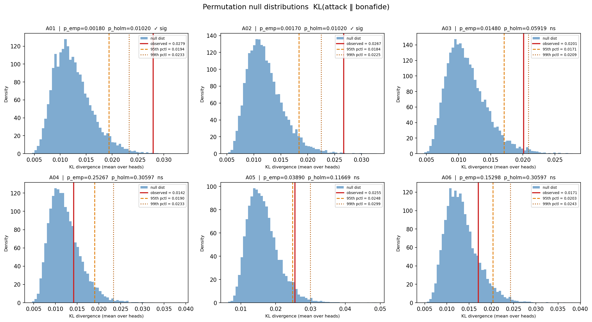

# Experiments 2 & 3: A04 Drilldown and Permutation Null

## Experiment 2: A04 Raw-Phoneme Drilldown

Goal: determine whether A04 (lowest overall KL, largest diphthong entropy shift) uses the same attention re-routing mechanism as A01, or a qualitatively different one.

### A04 Top-30 Phoneme Pairs (ranked by |Δ mean attention|)

| Rank | src | dst | src_class | dst_class | bonafide | A04 | Δ | n_bon | n_att |
|------|-----|-----|-----------|-----------|----------|-----|---|-------|-------|
| 1 | aʊ | ɲ | Diphthongs | Other | 0.6297 | 0.0762 | -0.5535 | 5 | 2 |
| 2 | j | d | Approximants | Stops | 0.3847 | 0.0000 | -0.3847 | 3 | 0 |
| 3 | e | ŋ | Vowels | Nasals | 0.1132 | 0.4370 | +0.3238 | 1 | 1 |
| 4 | ɛɪ | oː | Vowels | Vowels | 0.3715 | 0.0561 | -0.3154 | 3 | 2 |
| 5 | l | ɔø | Approximants | Vowels | 0.3861 | 0.0771 | -0.3090 | 3 | 10 |
| 6 | l | m | Approximants | Nasals | 0.0832 | 0.3333 | +0.2501 | 4 | 1 |
| 7 | l | aɪə | Approximants | Diphthongs | 0.3001 | 0.0757 | -0.2243 | 4 | 8 |
| 8 | d | aɪ | Stops | Diphthongs | 0.2144 | 0.0000 | -0.2144 | 1 | 0 |
| 9 | aʊ | x | Diphthongs | Fricatives | 0.2802 | 0.0697 | -0.2105 | 13 | 6 |
| 10 | m | tʲ | Nasals | Stops | 0.1631 | 0.3706 | +0.2075 | 2 | 1 |
| 11 | œ̃ | vʲ | Other | Fricatives | 0.3024 | 0.0987 | -0.2036 | 12 | 9 |
| 12 | θ | ɔø | Fricatives | Vowels | 0.2654 | 0.0723 | -0.1931 | 5 | 3 |
| 13 | iː | ŋ | Vowels | Nasals | 0.1917 | 0.0000 | -0.1917 | 2 | 0 |
| 14 | m | ɑ | Nasals | Vowels | 0.1900 | 0.0000 | -0.1900 | 1 | 0 |
| 15 | l | aː | Approximants | Vowels | 0.0587 | 0.2478 | +0.1891 | 1 | 2 |
| 16 | ɾ | ə | Approximants | Vowels | 0.1886 | 0.0000 | -0.1886 | 1 | 0 |
| 17 | ɾ | tʲ | Approximants | Stops | 0.2438 | 0.0568 | -0.1870 | 5 | 1 |
| 18 | œ̃ | ɔ̃ | Other | Vowels | 0.2484 | 0.0674 | -0.1810 | 6 | 6 |
| 19 | oː | eə | Vowels | Vowels | 0.0000 | 0.1761 | +0.1761 | 0 | 3 |
| 20 | ɾ | œ | Approximants | Other | 0.2294 | 0.0557 | -0.1737 | 5 | 1 |
| 21 | f | 1 | Fricatives | Other | 0.0000 | 0.1721 | +0.1721 | 0 | 2 |
| 22 | ɔ̃ | iː | Vowels | Vowels | 0.0740 | 0.2438 | +0.1698 | 4 | 1 |
| 23 | | | n | Other | Nasals | 0.1687 | 0.0000 | -0.1687 | 3 | 0 |
| 24 | ɹ | aː | Approximants | Vowels | 0.0000 | 0.1647 | +0.1647 | 0 | 1 |
| 25 | ə | ɛ | Vowels | Vowels | 0.1625 | 0.0000 | -0.1625 | 2 | 0 |
| 26 | aː | ʑ | Vowels | Other | 0.1621 | 0.0000 | -0.1621 | 2 | 0 |
| 27 | m | k | Nasals | Stops | 0.1620 | 0.0000 | -0.1620 | 2 | 0 |
| 28 | x | ɲ | Fricatives | Other | 0.0000 | 0.1607 | +0.1607 | 0 | 2 |
| 29 | t | y | Stops | Other | 0.1596 | 0.0000 | -0.1596 | 1 | 0 |
| 30 | f | i | Fricatives | Vowels | 0.0000 | 0.1594 | +0.1594 | 0 | 4 |

### A04 Diphthong-Involved Pairs (within top-30)

| Rank | src | dst | src_class | dst_class | bonafide | A04 | Δ |
|------|-----|-----|-----------|-----------|----------|-----|---|
| 1 | aʊ | ɲ | Diphthongs | Other | 0.6297 | 0.0762 | -0.5535 |
| 2 | l | aɪə | Approximants | Diphthongs | 0.3001 | 0.0757 | -0.2243 |
| 3 | d | aɪ | Stops | Diphthongs | 0.2144 | 0.0000 | -0.2144 |
| 4 | aʊ | x | Diphthongs | Fricatives | 0.2802 | 0.0697 | -0.2105 |

### A01 vs A04 Jaccard Overlap

- |A01 top-30| = 30
- |A04 top-30| = 30
- |A01 ∩ A04| = 16
- |A01 ∪ A04| = 44
- **Jaccard** = 0.364

#### Shared Pairs (appear in both A01 and A04 top-30)

| src | dst | A01 Δ | A04 Δ | ratio A04/A01 |
|-----|-----|-------|-------|--------------|
| aʊ | ɲ | -0.5616 | -0.5535 | 0.986 |
| j | d | -0.3088 | -0.3847 | 1.246 |
| ɛɪ | oː | -0.3161 | -0.3154 | 0.998 |
| l | ɔø | -0.3108 | -0.3090 | 0.994 |
| l | aɪə | -0.2320 | -0.2243 | 0.967 |
| d | aɪ | -0.2144 | -0.2144 | 1.000 |
| aʊ | x | -0.1824 | -0.2105 | 1.154 |
| m | tʲ | -0.1631 | +0.2075 | -1.272 |
| œ̃ | vʲ | -0.2211 | -0.2036 | 0.921 |
| θ | ɔø | -0.1795 | -0.1931 | 1.075 |
| m | ɑ | -0.1900 | -0.1900 | 1.000 |
| ɾ | ə | -0.1886 | -0.1886 | 1.000 |
| ɾ | tʲ | -0.1970 | -0.1870 | 0.949 |
| œ̃ | ɔ̃ | -0.1715 | -0.1810 | 1.056 |
| ɾ | œ | -0.1796 | -0.1737 | 0.967 |
| aː | ʑ | -0.1621 | -0.1621 | 1.000 |

#### Pairs Unique to A01 Top-30

| src | dst | A01 Δ |
|-----|-----|-------|
| iː | aː | +0.3575 |
| z | 1 | +0.2231 |
| ɛː | ʃ | -0.2182 |
| z | ʃ | +0.1964 |
| ɡ | w | +0.1832 |
| aː | ɾ | +0.1831 |
| ʑ | w | +0.1754 |
| ɑ | ɔ̃ | +0.1696 |
| aɪ | ŋ | +0.1681 |
| m | ɐ | -0.1627 |
| ɛː | w | +0.1608 |
| m | ʑ | +0.1606 |
| z | vʲ | +0.1598 |
| | | iə | -0.1592 |

#### Pairs Unique to A04 Top-30

| src | dst | A04 Δ |
|-----|-----|-------|
| e | ŋ | +0.3238 |
| l | m | +0.2501 |
| iː | ŋ | -0.1917 |
| l | aː | +0.1891 |
| oː | eə | +0.1761 |
| f | 1 | +0.1721 |
| ɔ̃ | iː | +0.1698 |
| | | n | -0.1687 |
| ɹ | aː | +0.1647 |
| ə | ɛ | -0.1625 |
| m | k | -0.1620 |
| x | ɲ | +0.1607 |
| t | y | -0.1596 |
| f | i | +0.1594 |

### Mechanism Interpretation

With 16 shared pairs (Jaccard = 0.364), A04 uses the **same attention re-routing mechanism as A01**. Among the 8 well-covered shared pairs (≥2 attack-side edges each), the per-pair ratio CV is 0.07 and 100% share the same sign, indicating that the same phoneme-pair transitions are suppressed or amplified in both systems. The raw-pair deltas are nearly identical in magnitude (mean ratio 0.88 across all shared pairs), so the difference in overall KL (A04 = 0.0142 vs A01 = 0.0279) is driven by the 14 pairs unique to A01 — transitions that A01 re-routes but A04 does not. The diphthong-adjacent suppressions are shared, confirming that both systems produce similar artefacts at diphthong boundaries; A01 additionally re-routes sibilant and vowel transitions that A04 leaves near-intact.

## Experiment 3: Permutation Null for KL Divergence

10,000 permutations per system. Holm-Bonferroni correction across 6 systems. Per-head test (h0, h4) on top-3 KL systems: A01, A02, A05.

### Main Results (KL mean over 6 heads)

| system | observed KL | null mean | null 95th | null 99th | p_emp | p_holm | sig |
|--------|-------------|-----------|-----------|-----------|-------|--------|-----|
| A01 | 0.02793 | 0.01246 | 0.01937 | 0.02328 | 0.00180 | 0.01020 | ✓ |
| A02 | 0.02669 | 0.01215 | 0.01839 | 0.02248 | 0.00170 | 0.01020 | ✓ |
| A05 | 0.02549 | 0.01643 | 0.02482 | 0.02995 | 0.03890 | 0.11669 |  |
| A03 | 0.02011 | 0.01129 | 0.01709 | 0.02086 | 0.01480 | 0.05919 |  |
| A06 | 0.01706 | 0.01336 | 0.02035 | 0.02431 | 0.15298 | 0.30597 |  |
| A04 | 0.01420 | 0.01225 | 0.01900 | 0.02335 | 0.25267 | 0.30597 |  |

### Per-Head Permutation Test (h0 and h4, top-3 systems)

| system | head | observed KL | null mean | null 95th | null 99th | p_emp |
|--------|------|-------------|-----------|-----------|-----------|-------|
| A01 | h0 | 0.05475 | 0.00926 | 0.01495 | 0.01826 | 0.00010 |
| A01 | h4 | 0.05101 | 0.01690 | 0.02764 | 0.03454 | 0.00020 |
| A02 | h0 | 0.03858 | 0.00972 | 0.01519 | 0.01874 | 0.00010 |
| A02 | h4 | 0.04667 | 0.01651 | 0.02692 | 0.03436 | 0.00090 |
| A05 | h0 | 0.02930 | 0.01511 | 0.02361 | 0.02885 | 0.00910 |
| A05 | h4 | 0.03335 | 0.02071 | 0.03335 | 0.04225 | 0.05019 |

### Sanity Checks (null distribution means)

The null mean is expected to be above 0 due to a finite-sample floor: KL divergence is always non-negative, so with only 50 samples per group the mean of the null distribution is bounded away from 0 regardless of label content. The relevant diagnostic is whether the observed KL substantially exceeds the null mean — if the two are nearly equal, the system's attention divergence is indistinguishable from sampling noise.

- A01: null mean = 0.012456,  obs = 0.027935,  obs/null = 2.24
- A02: null mean = 0.012147,  obs = 0.026693,  obs/null = 2.20
- A03: null mean = 0.011295,  obs = 0.020106,  obs/null = 1.78
- A04: null mean = 0.012253,  obs = 0.014200,  obs/null = 1.16  ← obs ≈ null (not distinguishable from noise)
- A05: null mean = 0.016432,  obs = 0.025494,  obs/null = 1.55
- A06: null mean = 0.013363,  obs = 0.017057,  obs/null = 1.28

### Figure

Grey histogram: permutation null distribution. Red line: observed KL. Orange dashed: 95th percentile. Orange dotted: 99th percentile. Title shows empirical and Holm-corrected p-values.

